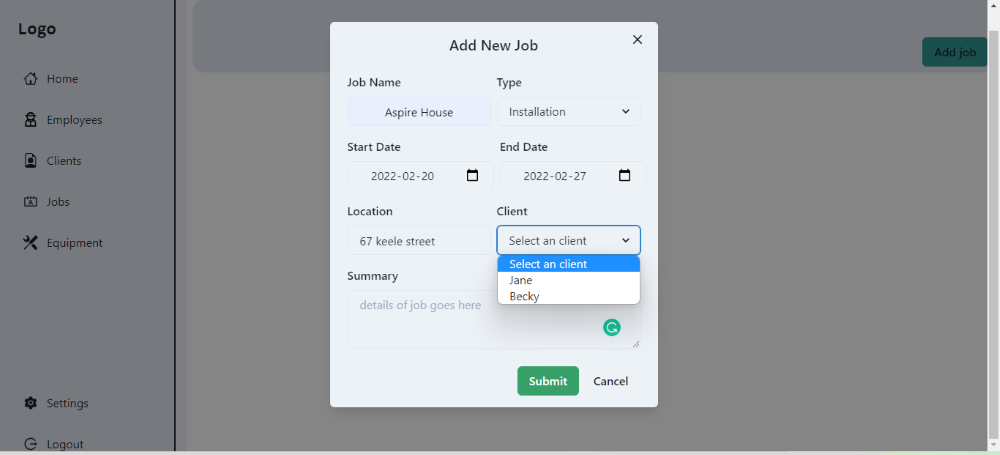
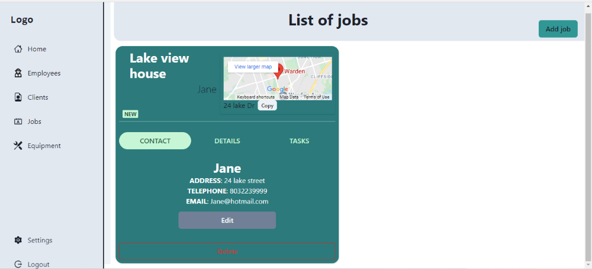
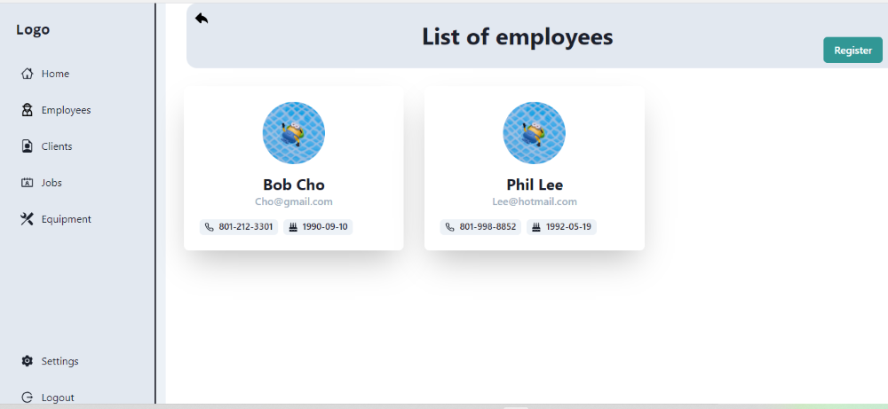
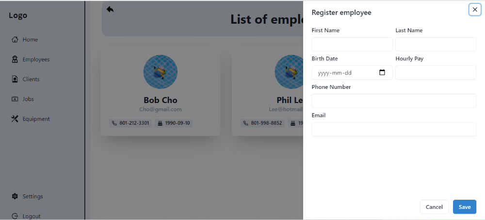
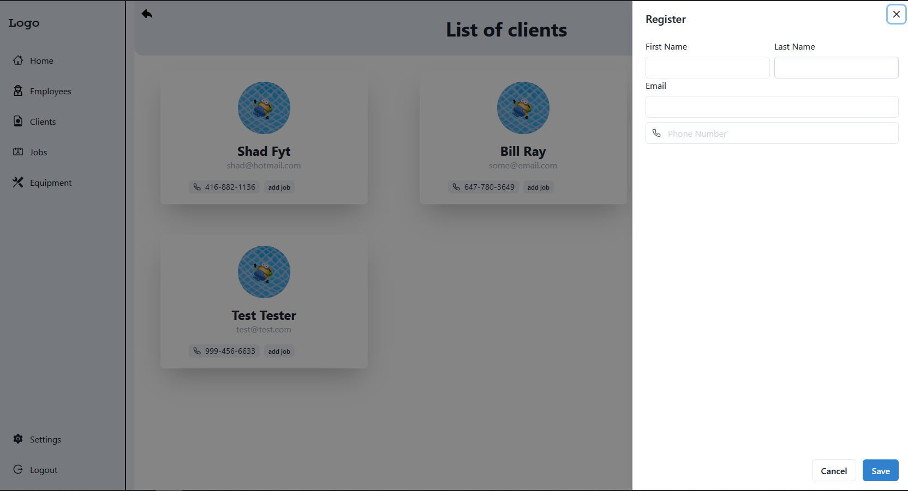

# A solution for facilitating a contractors administrative workload

Built using ReactJs(hooks), Redux(Toolkit) for state management and styled using Chakra ui components.
The server uses Python(FastAPI), SQLite and SQLModel.

## Link to server repo:

[https://github.com/ShadFyt/Contractor-Assist-back-end](https://github.com/ShadFyt/Contractor-Assist-back-end)

## Application Components

1. Job component is where you can add details related to the job such as:
   - Logging the hours of employees.
   - Lists tasks that are required to be completed.
   - Expenses
   - Client details

2. Employee component lists all employees and displays details & information
   
   

3. Client component lists all clients and displays details & information
   

4. Equipment component tracks location of the tools - not implemented yet

5. Home page dashboard style

## Road map/Todos

- [x] Create a homepage component that is dashboard style and will show important details about the company, static first
- [ ] Make homepage dashboard data driven and dynamic
- [x] List all clients on client page similar to the employee page
- [ ] Create single page for employees listing information like hours worked...
- [ ] Add a **Book time off** function for employees
- [ ] Create the Equipment component
- [ ] Refactor ClientProfile component
- [ ] Add a button to delete a client & employee
- [ ] Add user auth to web app
- [ ] make maps data driven instead of hard coded
